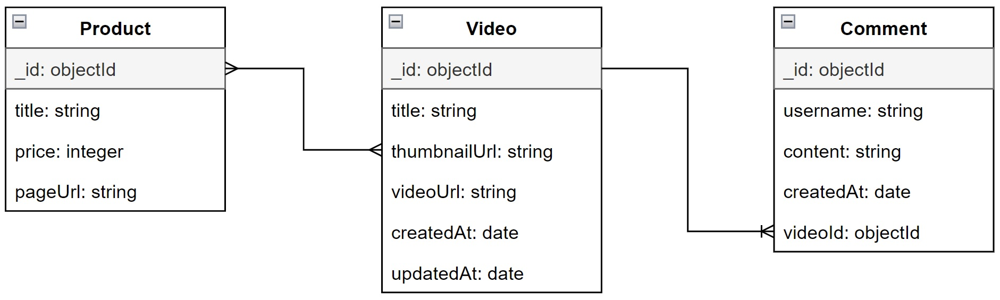

<div align="center">
  <br>
  <h1>Tokoplay API</h1>
  <p>Promote products through videos</p>
  <br>
</div>

## Table of Contents

- [Description](#description)
- [Live Demo](#live-demo)
- [Features](#features)
- [Tech Stack](#tech-stack)
- [Run Locally](#run-locally)
- [Database Structure](#database-structure)
- [API Structure](#api-structure)
- [API Endpoints](#api-endpoints)

## Description

[`^ back to top ^`](#table-of-contents)

**Tokoplay** is a platform where seller can promote products through videos to potential buyers. It is a simple clone of Tokopedia Play. This repo is the API of the app. It is built with [Express](https://expressjs.com). The data is stored in [MongoDB](https://www.mongodb.com) database. You can access the frontend app in [this repo](https://github.com/nadiannis/tokoplay-web).

## Live Demo

[`^ back to top ^`](#table-of-contents)

Check out the deployed API of **Tokoplay** here: [tokoplay.up.railway.app](https://tokoplay.up.railway.app)

## Features

[`^ back to top ^`](#table-of-contents)

- [Get list of videos](#get-apivideos)
- [Sort videos by the most recent](#get-apivideossortrecent)
- [Add a video](#post-apivideos)
- [Get video details](#get-apivideosvideoid)
- [Update a video](#patch-apivideosvideoid)
- [Delete a video](#delete-apivideosvideoid)
- [Get list of products](#get-apiproducts)
- [Add a product](#post-apiproducts)
- [Update a product](#patch-apiproductsproductid)
- [Delete a product](#delete-apiproductsproductid)
- [Get products of a video](#get-apivideosvideoidproducts)
- [Add product(s) to a video](#post-apivideosvideoidproducts)
- [Delete a product from a video](#delete-apivideosvideoidproductsproductid)
- [Get comments of a video](#get-apivideosvideoidcomments)
- [Sort comments by the most recent](#get-apivideosvideoidcommentssortrecent)
- [Add a comment to a video](#post-apivideosvideoidcomments)

## Tech Stack

[`^ back to top ^`](#table-of-contents)

- Language: [JavaScript](https://developer.mozilla.org/en-US/docs/Web/JavaScript)
- JavaScript Runtime Environment: [Node.js](https://nodejs.org)
- Web Framework: [Express](https://expressjs.com)
- Database: [MongoDB](https://www.mongodb.com)
- ODM: [Mongoose](https://mongoosejs.com)
- Linter: [ESLint](https://eslint.org)
- Code Formatter: [Prettier](https://prettier.io)

## Run Locally

[`^ back to top ^`](#table-of-contents)

### Getting Started

- Make sure you have [Node.js](https://nodejs.org) & [Yarn](https://yarnpkg.com) installed on your computer.

- Create a MongoDB database. You can create the database on your local, but make sure you have [MongoDB Community Server](https://www.mongodb.com/docs/manual/administration/install-community) & [MongoDB Shell](https://www.mongodb.com/try/download/shell) installed on your computer. You can also create the database in the cloud through [MongoDB Atlas](https://www.mongodb.com/atlas/database).

- Clone the repo.

  ```bash
  git clone https://github.com/nadiannis/tokoplay-api.git
  ```

  ```bash
  cd tokoplay-api
  ```

- Make a copy of `env.example` file & rename it to `.env`.

  Write a MongoDB URI to connect the API to a database. Make sure the MongoDB is ready to use. I use MongoDB database, named `tokoplay`.

  ```bash
  # example

  MONGODB_URI=mongodb://localhost:27017/tokoplay
  ```

- Install the dependencies.

  ```bash
  yarn
  ```

### Development

Run the development server. The API will run on port 8080, but you can change the port by specifying the `PORT` variable in `.env` file.

```bash
yarn dev
```

### Prepopulate Data

You can prepopulate data into the database. I put the sample data in `./src/seeds/data/`. The data is in JSON. There are 2 ways to prepopulate data into the database.

**1. By running a script.**

The script is located in `./src/seeds/index.js`. Prepopulate the data by running this command in the root of the project.

```bash
node ./src/seeds/index
```

You can also use [Yarn](https://yarnpkg.com) to run the script.

```bash
yarn seed
```

**2. By importing directly through [MongoDB Atlas](https://www.mongodb.com/atlas/database) or [MongoDB Compass](https://www.mongodb.com/products/compass).**

If you can access the database directly, you can import JSON data through [MongoDB Atlas](https://www.mongodb.com/atlas/database) or [MongoDB Compass](https://www.mongodb.com/products/compass) installed on your computer. First, make sure that the database (`tokoplay`) & collections (`products`, `videos`, `comments`) are created. Then in each collection, import the JSON data.

## Database Structure

[`^ back to top ^`](#table-of-contents)

### Database Design

Here you can see the relationships between entities.



### Database Implemented in MongoDB

This is the implementation of the database design in MongoDB.

**products**

```
{
  "_id": objectId,
  "title": string,
  "price": integer,
  "pageUrl": string
}
```

**videos**

```
{
  "_id": objectId,
  "title": string,
  "thumbnailUrl": string,
  "videoUrl": string,
  "createdAt": date,
  "updatedAt": date,
  "products": array(objectId)
}
```

**comments**

```
{
  "_id": objectId,
  "username": string,
  "content": string,
  "createdAt": date,
  "videoId": objectId
}
```

### Database Explanation

- There are 3 collections: `products`, `videos`, & `comments`.
- A video can have many products, and a product can be in many videos. It is **many-to-many relationship**. In MongoDB, we can use array as a value of the field. Instead of adding a collection to store the id of video & product, I put array of product id in each video document since the products will also need to be retrieved when a video is retrieved.
- A video has many comments. But a comment belongs to just one video. It is **one-to-many relationship**. There is a video id in each comment document to identify which comment belongs to which video.

## API Structure

[`^ back to top ^`](#table-of-contents)

I use N-layer architecture for the API, which includes a controller, service, & model. N-layer architecture is a pattern used to organize & separate concerns in software development, making the code more modular & maintainable.

- **Model Layer**: This layer contains the data model. Models represent the data structures & interactions with the database.
- **Service Layer**: This layer contains core business logic of the API.
- **Controller Layer**: This layer is responsible for handling the requests, process them, & send back responses.

```
.
├── src              # contains main source code
│   ├── controllers  # stores the controllers
│   ├── models       # stores the models
│   ├── routes       # contains route files
│   ├── seeds        # contains sample data in json that can be prepopulated to db
│   ├── services     # contains business logic
│   ├── utils        # stores utility functions
│   └── index.js     # the entry point
├── .env             # stores environment variables
├── ...
├── package.json     # contains information about the project, dependencies, scripts, configs
├── README.md        # documentation
├── yarn.lock
.
```

## API Endpoints

[`^ back to top ^`](#table-of-contents)

**Video**

- Video object

```
{
  "_id": string,
  "title": string,
  "thumbnailUrl": string,
  "videoUrl": string,
  "createdAt": datetime,
  "updatedAt": datetime,
  "products": [<product_id>, <product_id>, ...]
}
```

- Simpler video object (not full)

```
{
  "_id": string,
  "title": string,
  "thumbnailUrl": string,
  "createdAt": datetime
}
```

- Video object with products populated

```
{
  "_id": string,
  "title": string,
  "thumbnailUrl": string,
  "videoUrl": string,
  "createdAt": datetime,
  "updatedAt": datetime,
  "products": [
    {<product_object>},
    {<product_object>},
    ...
  ]
}
```

### GET /api/videos

[`^ back to top ^`](#features)

Returns all videos.

- **URL Params**

  None

- **Data Params**

  None

- **Headers**

  Content-Type: application/json

- **Success Response**

  - **Code: 200**

    Content:

    ```
    {
      "status": "success",
      "message": "Videos retrieved successfully",
      "data": [
        {<simpler_video_object>},
        {<simpler_video_object>},
        {<simpler_video_object>},
        {<simpler_video_object>},
        {<simpler_video_object>},
        {<simpler_video_object>},
        {<simpler_video_object>},
        {<simpler_video_object>},
        {<simpler_video_object>},
        {<simpler_video_object>},
        {<simpler_video_object>},
        {<simpler_video_object>},
      ],
      "page": integer,
      "totalPages": integer,
      "count": integer
    }
    ```

    OR

    Content:

    ```
    {
      "status": "success",
      "message": "There are no videos available",
      "data": [],
      "page": 1,
      "totalPages": 0,
      "count": 0
    }
    ```

- **Error Response**

  - **Code: 500**

    Content:

    ```
    {
      "status": "error",
      "message": <error_message>
    }
    ```

### GET /api/videos?sort=recent

[`^ back to top ^`](#features)

Returns all videos sorted by the most recent.

- **URL Params**

  None

- **Data Params**

  None

- **Headers**

  Content-Type: application/json

- **Success Response**

  - **Code: 200**

    Content:

    ```
    {
      "status": "success",
      "message": "Videos retrieved successfully",
      "data": [
        {<simpler_video_object>},
        {<simpler_video_object>},
        {<simpler_video_object>},
        {<simpler_video_object>},
        {<simpler_video_object>},
        {<simpler_video_object>},
        {<simpler_video_object>},
        {<simpler_video_object>},
        {<simpler_video_object>},
        {<simpler_video_object>},
        {<simpler_video_object>},
        {<simpler_video_object>},
      ],
      "page": integer,
      "totalPages": integer,
      "count": integer
    }
    ```

    OR

    Content:

    ```
    {
      "status": "success",
      "message": "There are no videos available",
      "data": [],
      "page": 1,
      "totalPages": 0,
      "count": 0
    }
    ```

- **Error Response**

  - **Code: 500**

    Content:

    ```
    {
      "status": "error",
      "message": <error_message>
    }
    ```

### POST /api/videos

[`^ back to top ^`](#features)

Creates a new video & returns the new object.

- **URL Params**

  None

- **Data Params**

  ```
  {
    "title": string,
    "thumbnailUrl": string,
    "videoUrl": string
  }
  ```

- **Headers**

  Content-Type: application/json

- **Success Response**

  - **Code: 201**

    Content:

    ```
    {
      "status": "success",
      "message": "Video created successfully",
      "data": {<video_object>}
    }
    ```

- **Error Response**

  - **Code: 400**

    Content:

    ```
    {
      "status": "error",
      "message": "Invalid request body"
    }
    ```

    OR

  - **Code: 500**

    Content:

    ```
    {
      "status": "error",
      "message": <error_message>
    }
    ```

### GET /api/videos/:videoId

[`^ back to top ^`](#features)

Returns the specified video.

- **URL Params**

  _Required:_ `videoId=[string]`

- **Data Params**

  None

- **Headers**

  Content-Type: application/json

- **Success Response**

  - **Code: 200**

    Content:

    ```
    {
      "status": "success",
      "message": "Video retrieved successfully",
      "data": {<video_object_with_products_populated>}
    }
    ```

- **Error Response**

  - **Code: 400**

    Content:

    ```
    {
      "status": "error",
      "message": "Video ID is not valid"
    }
    ```

    OR

  - **Code: 404**

    Content:

    ```
    {
      "status": "error",
      "message": "Video not found"
    }
    ```

    OR

  - **Code: 500**

    Content:

    ```
    {
      "status": "error",
      "message": <error_message>
    }
    ```

### PATCH /api/videos/:videoId

[`^ back to top ^`](#features)

Updates fields on the specified video & returns the updated object.

- **URL Params**

  _Required:_ `videoId=[string]`

- **Data Params**

  ```
  {
    "title": string,
    "thumbnailUrl": string,
    "videoUrl": string
  }
  ```

- **Headers**

  Content-Type: application/json

- **Success Response**

  - **Code: 200**

    Content:

    ```
    {
      "status": "success",
      "message": "Video updated successfully",
      "data": {<video_object>}
    }
    ```

- **Error Response**

  - **Code: 400**

    Content:

    ```
    {
      "status": "error",
      "message": "Video ID is not valid"
    }
    ```

    OR

  - **Code: 404**

    Content:

    ```
    {
      "status": "error",
      "message": "Video not found"
    }
    ```

    OR

  - **Code: 500**

    Content:

    ```
    {
      "status": "error",
      "message": <error_message>
    }
    ```

### DELETE /api/videos/:videoId

[`^ back to top ^`](#features)

Deletes the specified video.

- **URL Params**

  _Required:_ `videoId=[string]`

- **Data Params**

  None

- **Headers**

  Content-Type: application/json

- **Success Response**

  - **Code: 200**

  Content:

  ```
  {
    "status": "success",
    "message": "Video deleted successfully"
  }
  ```

- **Error Response**

  - **Code: 400**

    Content:

    ```
    {
      "status": "error",
      "message": "Video ID is not valid"
    }
    ```

    OR

  - **Code: 404**

    Content:

    ```
    {
      "status": "error",
      "message": "Video not found"
    }
    ```

    OR

  - **Code: 500**

    Content:

    ```
    {
      "status": "error",
      "message": <error_message>
    }
    ```

---

**Product**

- Product object

```
{
  "_id": string,
  "title": string,
  "price": integer,
  "pageUrl": string
}
```

### GET /api/products

[`^ back to top ^`](#features)

Returns all products.

- **URL Params**

  None

- **Data Params**

  None

- **Headers**

  Content-Type: application/json

- **Success Response**

  - **Code: 200**

    Content:

    ```
    {
      "status": "success",
      "message": "Products retrieved successfully",
      "data": [
        {<product_object>},
        {<product_object>},
        {<product_object>},
        {<product_object>},
        {<product_object>},
        {<product_object>},
        {<product_object>},
        {<product_object>},
        {<product_object>},
        {<product_object>},
        {<product_object>},
        {<product_object>},
      ],
      "page": integer,
      "totalPages": integer,
      "count": integer
    }
    ```

    OR

    Content:

    ```
    {
      "status": "success",
      "message": "There are no products available",
      "data": [],
      "page": 1,
      "totalPages": 0,
      "count": 0
    }
    ```

- **Error Response**

  - **Code: 500**

    Content:

    ```
    {
      "status": "error",
      "message": <error_message>
    }
    ```

### POST /api/products

[`^ back to top ^`](#features)

Creates a new product & returns the new object.

- **URL Params**

  None

- **Data Params**

  ```
  {
    "title": string,
    "price": integer,
    "pageUrl": string
  }
  ```

- **Headers**

  Content-Type: application/json

- **Success Response**

  - **Code: 201**

    Content:

    ```
    {
      "status": "success",
      "message": "Product created successfully",
      "data": {<product_object>}
    }
    ```

- **Error Response**

  - **Code: 400**

    Content:

    ```
    {
      "status": "error",
      "message": "Invalid request body"
    }
    ```

    OR

  - **Code: 500**

    Content:

    ```
    {
      "status": "error",
      "message": <error_message>
    }
    ```

### PATCH /api/products/:productId

[`^ back to top ^`](#features)

Updates fields on the specified product & returns the updated object.

- **URL Params**

  _Required:_ `productId=[string]`

- **Data Params**

  ```
  {
    "title": string,
    "price": integer,
    "pageUrl": string
  }
  ```

- **Headers**

  Content-Type: application/json

- **Success Response**

  - **Code: 200**

    Content:

    ```
    {
      "status": "success",
      "message": "Product updated successfully",
      "data": {<product_object>}
    }
    ```

- **Error Response**

  - **Code: 400**

    Content:

    ```
    {
      "status": "error",
      "message": "Product ID is not valid"
    }
    ```

    OR

  - **Code: 404**

    Content:

    ```
    {
      "status": "error",
      "message": "Product not found"
    }
    ```

    OR

  - **Code: 500**

    Content:

    ```
    {
      "status": "error",
      "message": <error_message>
    }
    ```

### DELETE /api/products/:productId

[`^ back to top ^`](#features)

Deletes the specified product.

- **URL Params**

  _Required:_ `productId=[string]`

- **Data Params**

  None

- **Headers**

  Content-Type: application/json

- **Success Response**

  - **Code: 200**

  Content:

  ```
  {
    "status": "success",
    "message": "Product deleted successfully"
  }
  ```

- **Error Response**

  - **Code: 400**

    Content:

    ```
    {
      "status": "error",
      "message": "Product ID is not valid"
    }
    ```

    OR

  - **Code: 404**

    Content:

    ```
    {
      "status": "error",
      "message": "Product not found"
    }
    ```

    OR

  - **Code: 500**

    Content:

    ```
    {
      "status": "error",
      "message": <error_message>
    }
    ```

### GET /api/videos/:videoId/products

[`^ back to top ^`](#features)

Returns all products associated with the specified video.

- **URL Params**

  _Required:_ `videoId=[string]`

- **Data Params**

  None

- **Headers**

  Content-Type: application/json

- **Success Response**

  - **Code: 200**

    Content:

    ```
    {
      "status": "success",
      "message": "Products of the video retrieved successfully",
      "data": [
        {<product_object>},
        {<product_object>},
        {<product_object>},
        {<product_object>},
        {<product_object>},
        {<product_object>},
        {<product_object>},
        {<product_object>},
        {<product_object>},
        {<product_object>},
        {<product_object>},
        {<product_object>},
      ]
    }
    ```

    OR

    Content:

    ```
    {
      "status": "success",
      "message": "There are no products in the video",
      "data": []
    }
    ```

- **Error Response**

  - **Code: 400**

    Content:

    ```
    {
      "status": "error",
      "message": "Video ID is not valid"
    }
    ```

    OR

  - **Code: 404**

    Content:

    ```
    {
      "status": "error",
      "message": "Video not found"
    }
    ```

    OR

  - **Code: 500**

    Content:

    ```
    {
      "status": "error",
      "message": <error_message>
    }
    ```

### POST /api/videos/:videoId/products

[`^ back to top ^`](#features)

Adds product(s) to the specified video & returns the updated specified video with the products.

- **URL Params**

  _Required:_ `videoId=[string]`

- **Data Params**

  ```
  {
    "productIds": [<product_id>, <product_id>, ...]
  }
  ```

- **Headers**

  Content-Type: application/json

- **Success Response**

  - **Code: 201**

    Content:

    ```
    {
      "status": "success":
      "message": "Products added to the video successfully",
      "data": {<video_object>}
    }
    ```

- **Error Response**

  - **Code: 400**

    Content:

    ```
    {
      "status": "error",
      "message": "Video ID is not valid"
    }
    ```

    OR

    Content:

    ```
    {
      "status": "error",
      "message": "Invalid request body"
    }
    ```

    OR

    Content:

    ```
    {
      "status": "error",
      "message": "productIds should be an array"
    }
    ```

    OR

    Content:

    ```
    {
      "status": "error",
      "message": "There is something wrong with the product ID. Product may not be found in the database. Make sure the product ID is correct."
    }
    ```

    OR

  - **Code: 404**

    Content:

    ```
    {
      "status": "error",
      "message": "Video not found"
    }
    ```

    OR

  - **Code: 500**

    Content:

    ```
    {
      "status": "error",
      "message": <error_message>
    }
    ```

### DELETE /api/videos/:videoId/products/:productId

[`^ back to top ^`](#features)

Deletes a product from a specified video & returns the updated specified video with the products.

- **URL Params**

  _Required:_ `videoId=[string]` & _Required:_ `productId=[string]`

- **Data Params**

  None

- **Headers**

  Content-Type: application/json

- **Success Response**

  - **Code: 200**

    Content:

    ```
    {
      "status": "success":
      "message": "Product removed from the video successfully",
      "data": {<video_object>}
    }
    ```

- **Error Response**

  - **Code: 400**

    Content:

    ```
    {
      "status": "error",
      "message": "Video ID is not valid"
    }
    ```

    OR

    Content:

    ```
    {
      "status": "error",
      "message": "Product ID is not valid"
    }
    ```

    OR

  - **Code: 404**

    Content:

    ```
    {
      "status": "error",
      "message": "Video not found"
    }
    ```

    OR

    Content:

    ```
    {
      "status": "error",
      "message": "Product not found in the video"
    }
    ```

    OR

  - **Code: 500**

    Content:

    ```
    {
      "status": "error",
      "message": <error_message>
    }
    ```

---

**Comment**

- Comment object

```
{
  "_id": string,
  "username": string,
  "content": string,
  "createdAt": datetime,
  "videoId": <video_id>
}
```

### GET /api/videos/:videoId/comments

[`^ back to top ^`](#features)

Returns all comments associated with the specified video.

- **URL Params**

  _Required:_ `videoId=[string]`

- **Data Params**

  None

- **Headers**

  Content-Type: application/json

- **Success Response**

  - **Code: 200**

    Content:

    ```
    {
      "status": "success",
      "message": "Comments of the video retrieved successfully",
      "data": [
        {<comment_object>},
        {<comment_object>},
        {<comment_object>},
        {<comment_object>},
        {<comment_object>},
        {<comment_object>},
        {<comment_object>},
        {<comment_object>},
        {<comment_object>},
        {<comment_object>},
        {<comment_object>},
        {<comment_object>},
      ],
      "page": integer,
      "totalPages": integer,
      "count": integer
    }
    ```

    OR

    Content:

    ```
    {
      "status": "success",
      "message": "There are no comments in the video",
      "data": [],
      "page": 1,
      "totalPages": 0,
      "count": 0
    }
    ```

- **Error Response**

  - **Code: 400**

    Content:

    ```
    {
      "status": "error",
      "message": "Video ID is not valid"
    }
    ```

    OR

  - **Code: 404**

    Content:

    ```
    {
      "status": "error",
      "message": "Video not found"
    }
    ```

    OR

  - **Code: 500**

    Content:

    ```
    {
      "status": "error",
      "message": <error_message>
    }
    ```

### GET /api/videos/:videoId/comments?sort=recent

[`^ back to top ^`](#features)

Returns all comments associated with the specified video, sorted by the most recent.

- **URL Params**

  _Required:_ `videoId=[string]`

- **Data Params**

  None

- **Headers**

  Content-Type: application/json

- **Success Response**

  - **Code: 200**

    Content:

    ```
    {
      "status": "success",
      "message": "Comments of the video retrieved successfully",
      "data": [
        {<comment_object>},
        {<comment_object>},
        {<comment_object>},
        {<comment_object>},
        {<comment_object>},
        {<comment_object>},
        {<comment_object>},
        {<comment_object>},
        {<comment_object>},
        {<comment_object>},
        {<comment_object>},
        {<comment_object>},
      ],
      "page": integer,
      "totalPages": integer,
      "count": integer
    }
    ```

    OR

    Content:

    ```
    {
      "status": "success",
      "message": "There are no comments in the video",
      "data": [],
      "page": 1,
      "totalPages": 0,
      "count": 0
    }
    ```

- **Error Response**

  - **Code: 400**

    Content:

    ```
    {
      "status": "error",
      "message": "Video ID is not valid"
    }
    ```

    OR

  - **Code: 404**

    Content:

    ```
    {
      "status": "error",
      "message": "Video not found"
    }
    ```

    OR

  - **Code: 500**

    Content:

    ```
    {
      "status": "error",
      "message": <error_message>
    }
    ```

### POST /api/videos/:videoId/comments

[`^ back to top ^`](#features)

Creates a new comment associated with the specified video & returns the new object.

- **URL Params**

  _Required:_ `videoId=[string]`

- **Data Params**

  ```
  {
    "username": string,
    "content": string
  }
  ```

- **Headers**

  Content-Type: application/json

- **Success Response**

  - **Code: 201**

    Content:

    ```
    {
      "status": "success":
      "message": "Comment created successfully",
      "data": {<comment_object>}
    }
    ```

- **Error Response**

  - **Code: 400**

    Content:

    ```
    {
      "status": "error",
      "message": "Video ID is not valid"
    }
    ```

    OR

    Content:

    ```
    {
      "status": "error",
      "message": "Invalid request body"
    }
    ```

    OR

  - **Code: 404**

    Content:

    ```
    {
      "status": "error",
      "message": "Video not found"
    }
    ```

    OR

  - **Code: 500**

    Content:

    ```
    {
      "status": "error",
      "message": <error_message>
    }
    ```
